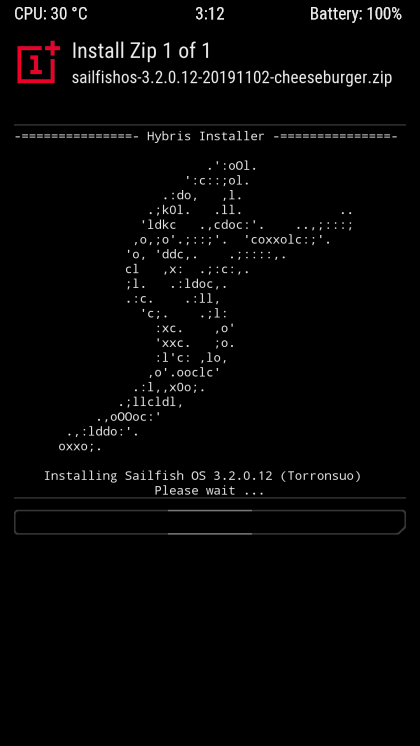

# hybris-installer
A visually appealing & extensible custom Hybris Installer script by default for the OnePlus 5 & OnePlus 5T devices, now rewritten for the FP4 (Fairphone 4).

This replaces the default hybris-boot installer script implementation.

## Screenshot



## Adaptation guide

To get a quick start you can simply execute the following in your PLATFORM_SDK environment:
```
cd $ANDROID_ROOT/
git clone https://github.com/sailfishos-oneplus5/hybris-installer hybris/hybris-installer/
mkdir hybris/droid-configs/kickstart/
curl -L https://raw.githubusercontent.com/SailfishOS-for-the-fairphone-4/droid-configs-FP4/master/kickstart/pack_package-droid-updater -o hybris/droid-configs/kickstart/pack_package-droid-updater
```

I do however recommend forking the project to keep up-to-date with any changes I may make here and rebase easily when considering using this long-term :)
